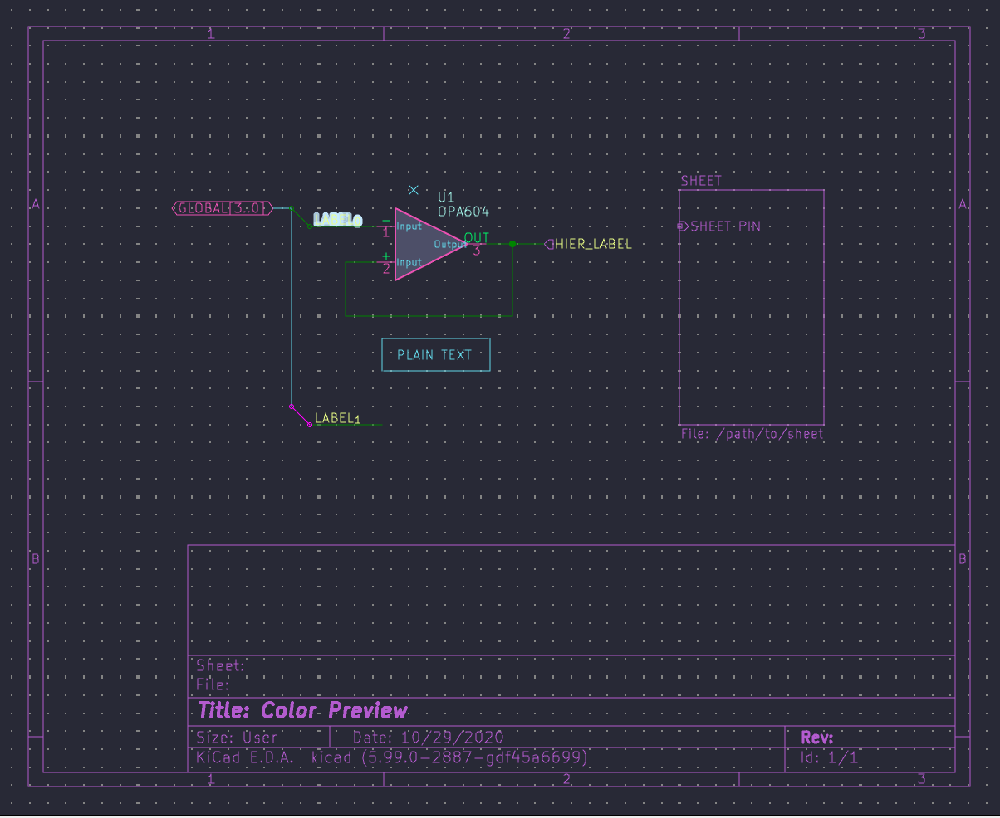
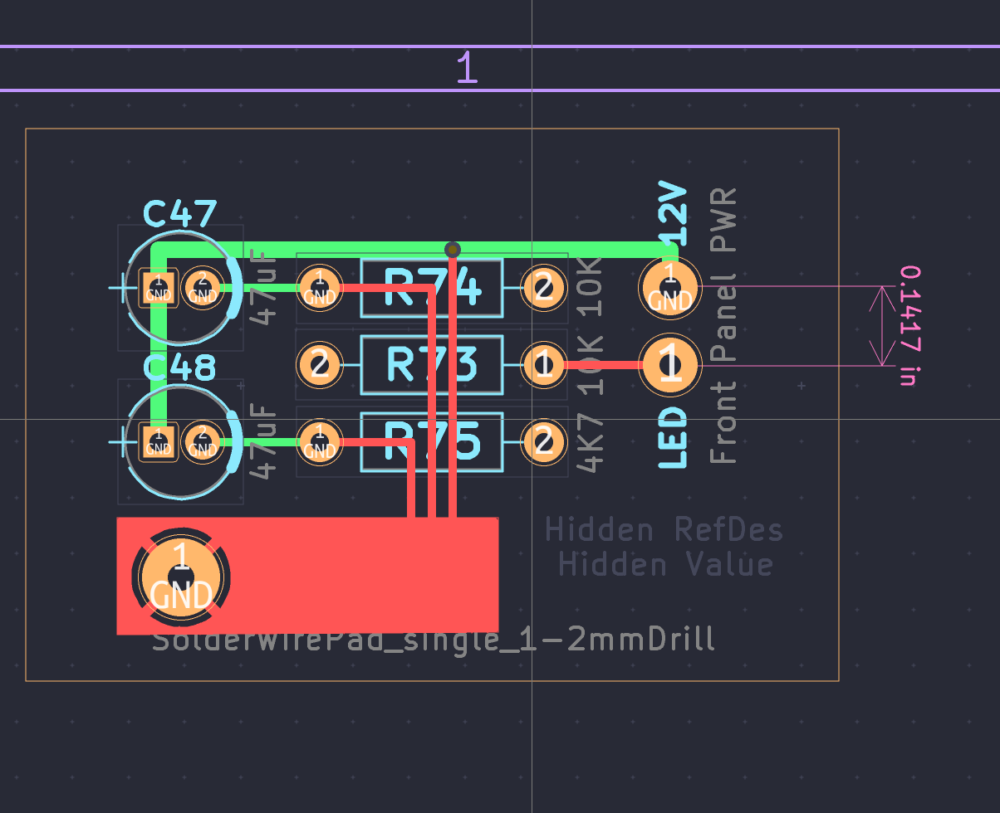

# Dracula for [KiCad](https://kicad-pcb.org/)

> A dark theme for [KiCad](https://kicad-pcb.org/).

This theme currently supports the 2020 version of
* **eschema** schematic editor
* **pcbnew** PCB designer

## Install

All instructions can be found at [draculatheme.com/kicad](https://draculatheme.com/kicad).

## Team

This theme is maintained by the following person(s) and a bunch of [awesome contributors](https://github.com/dracula/kicad/graphs/contributors).

|  |
|---|
| [Matt Bagnara](https://github.com/bagnaram) |

## License

[MIT License](./LICENSE)
